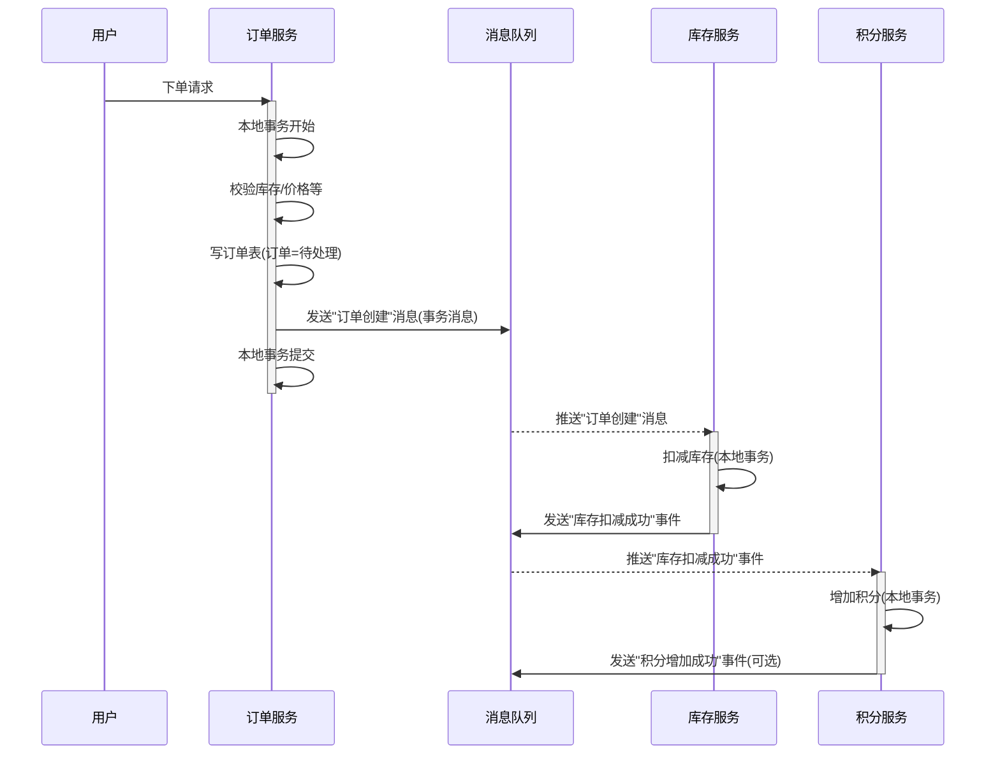
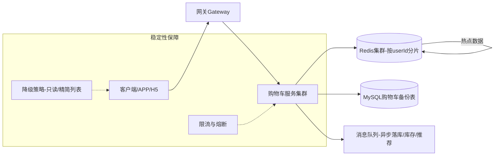

# Java 面试题汇总

> 本文档用于整理常见 Java 面试题及答案，由 AI 辅助生成。

---

后续每道题都会包含：
- 题目描述
- 详细答案与要点
- 如有需要，会使用 Mermaid 等形式画出结构/流程示意图（可在 VS Code 或 GitHub 直接预览）

下面开始记录你的第一个问题。

---

## 1. 如何实时统计 vivo 商城的每分钟下单量？

### 思路与总体方案

- **核心目标**：实时（或准实时）统计最近每分钟的下单量，用于看运营效果、监控流量突增、风控预警等。
- **关键点**：高并发下单写入、实时流式统计、按时间窗口聚合（每分钟）、低延迟可视化/查询。

整体可以采用「消息队列 + 流式计算 + 时序存储/缓存」的典型实时统计架构。

### 参考架构示意图（Mermaid）

```mermaid
flowchart LR
    A[用户在 vivo 商城下单] --> B[订单服务(Sprint Boot)]
    B -->|写入DB| C[(订单数据库)]
    B -->|发送下单事件| D[订单消息主题(Kafka/RocketMQ)]

    D --> E[流式计算引擎(Flink/Spark Streaming)]
    E -->|按1分钟窗口聚合| F[(Redis/TSDB-每分钟下单量)]

    F --> G[监控与报表系统]
```

### 关键技术点拆解

1. **订单服务产生事件**
   - 下单接口成功后（事务提交后），发送一条「订单已创建」事件到消息队列（如 Kafka、RocketMQ）。
   - 事件内容至少包含：订单 ID、用户 ID、下单时间（事件时间）、金额、渠道等。

2. **消息队列解耦 + 削峰**
   - 所有下单事件先进入 MQ，可以**平滑高并发写入**，并支持**多消费方**（统计、风控、推荐等）。
   - 通过分区机制实现水平扩展，保证吞吐。

3. **流式计算做「每分钟窗口聚合」**
   - 使用 Flink / Spark Streaming，消费订单事件流。
   - 按照订单事件时间（`orderTime`）做**滚动时间窗口**统计：
     - 滚动窗口：`1 min`，每分钟一条结果。
     - 若对延迟要求更高，可以结合**滑动窗口** + **预聚合**。
   - 处理乱序：使用**Watermark（水位线）**，允许一定程度的延迟事件（例如 2 分钟内的迟到订单仍然统计进对应分钟）。

4. **结果写入 Redis / 时序数据库**
   - 典型：Flink 聚合后将结果写入 Redis：
     - key：`order_stat:{yyyyMMddHHmm}`
     - value：该分钟的下单数量（及其他指标：GMV、成功支付数等）。
   - 也可以写入 InfluxDB、ClickHouse 之类的时序/分析型数据库，方便历史数据分析。

5. **对外提供实时查询/大屏展示**
   - 运营后台 / 监控大屏周期性（例如每 5s）从 Redis 拉取最近 N 分钟下单量绘图。
   - 也可以封装为一个统计服务 API，对外提供实时指标查询。

### 一个简化的 Flink 统计逻辑示意（伪代码）

```java
// 伪代码，仅体现核心思路
DataStream<OrderEvent> events = env
    .addSource(kafkaSource)
    // 指定事件时间字段
    .assignTimestampsAndWatermarks(
        WatermarkStrategy
            .<OrderEvent>forBoundedOutOfOrderness(Duration.ofMinutes(2))
            .withTimestampAssigner((event, ts) -> event.getOrderTime())
    );

events
    .keyBy(e -> 1) // 全局一个 key，统计总下单量；也可按渠道/城市等维度分 key
    .window(TumblingEventTimeWindows.of(Time.minutes(1)))
    .aggregate(new CountAgg())  // 自定义聚合函数，统计数量
    .addSink(redisSink);        // 写入 Redis（key=时间分钟，value=count）
```

### 可能的追问与优化点

- **如何应对流量高峰？**
  - MQ 分区扩容，Flink 并行度提升，订单服务水平扩展。
- **如何保证统计的准确性？**
  - 使用事件时间 + Watermark 处理乱序。
  - 对极端迟到数据做补偿机制（离线修正 + T+1 校准）。
- **如何支持多维度统计？**
  - 在流式计算中按不同维度 `keyBy`，分别聚合（如按渠道、城市、终端等）。

这类题目面试官通常希望你能说出：**消息队列解耦 + 流式计算（Flink）+ 时间窗口 + Redis/TSDB 存储 + 实时展示** 这一整套思路，并能讲清楚高并发、乱序事件和延迟的处理方式。

---

## 2. 用户下单时需要扣减库存、生成订单、增加积分，如何保证三个操作的事务一致性？

### 问题分析

涉及三个子系统或表：

- **订单服务**：创建订单记录
- **库存服务**：扣减商品库存
- **积分/账户服务**：给用户增加积分

如果在**同一个库、同一个服务内**，可以用本地事务解决；但在实际电商中，往往是**多个微服务 + 多个数据库**，这就变成了一个**分布式事务问题**。

### 情况一：单体/单库场景（本地事务）

若订单表、库存表、积分表在同一个数据库中，且由同一个应用服务操作：

- 使用 **Spring + 本地事务（`@Transactional`）**：
  - 一个方法内依次执行：扣库存 → 生成订单 → 增加积分。
  - 三个操作在**同一个数据库事务里**，要么都成功，要么都回滚。

```java
@Transactional
public void placeOrder(OrderRequest req) {
    stockService.deduct(req.getSkuId(), req.getCount());
    Order order = orderService.createOrder(req);
    pointService.addPoint(order.getUserId(), order.getAmount());
}
```

缺点：不利于服务拆分和水平扩展，是面试中「过于简单」但需要先提到的基础方案。

### 情况二：微服务/多库场景（分布式事务）

订单、库存、积分通常是三个微服务，对应三个库：

- 不能简单依赖数据库本地事务，需要**分布式事务或最终一致性方案**。

常见几种思路：

1. **TCC（Try-Confirm-Cancel）模式**
   - Try：预留资源（冻结库存，记录待确认积分）。
   - Confirm：订单创建成功后，确认扣减库存、正式加积分。
   - Cancel：订单失败时，释放库存，回滚积分。
   - 通过 TCC 框架（如 Seata TCC）协调多个服务的一致性。

2. **可靠消息 + 最终一致性（事务消息）**
   - 订单服务本地事务：创建订单 + 发送「订单创建成功」的消息（事务性发送）。
   - 库存服务订阅消息：扣减库存，成功后发送「库存扣减成功」消息。
   - 积分服务订阅相应事件：增加积分。
   - 若中间任何一步失败，通过重试/补偿保证**最终一致性**，而不是强一致。

3. **分布式事务框架（例如 Seata AT 模式）**
   - 通过全局事务 ID 协调多个服务，本质是两阶段提交 + 回滚日志。
   - 适合改造成本可接受、并且对强一致性有比较高要求的场景。

### 推荐方案：可靠消息 + 本地事务（最终一致性）

在高并发电商场景中，普遍推荐：

- **订单服务**内部使用本地事务保证「订单落库 + 发送消息」的一致性。
- **库存服务、积分服务**各自使用本地事务处理自己的业务，并订阅订单相关的领域事件。

#### 简化流程示意图（Mermaid 序列图）



要点：

- 每个服务内部依然使用**本地事务**确保自身数据一致。
- 服务之间通过**消息队列 + 重试机制**实现最终一致性，而不是用跨库事务锁住所有资源。

### 面试时可以这样组织回答

1. 先区分：**单体/单库** vs **微服务/多库**。
2. 单库场景：`@Transactional` 包住三步操作即可（顺便提一下隔离级别、回滚场景）。
3. 多库场景：这是一个典型**分布式事务问题**，常见有：
   - 2PC / XA（很少在高并发互联网场景落地，性能和可用性不好）。
   - TCC 模式（Try-Confirm-Cancel）。
   - 可靠消息 + 本地事务（最终一致性）。
   - 分布式事务框架（如 Seata AT/TCC/SAGA 等）。
4. 最后重点推荐：
   - 使用**可靠消息 + 本地事务**的方式：
     - 订单本地事务 + 发送订单事件。
     - 库存消费订单事件，本地扣减库存 + 发送扣减成功事件。
     - 积分消费库存成功事件，本地增加积分。
   - 通过补偿、重试机制保证最终一致性，兼顾性能与可用性.

---

## 3. vivo 商城购物车在促销期间访问量激增，如何设计高并发的购物车服务？

### 问题背景

- 促销期间用户频繁：加入购物车、修改数量、勾选/取消、查询购物车列表等操作。
- 购物车读请求远大于写请求，但在活动场景下**写也会很多**。
- 要求：
  - 高并发、高可用，不能成为下单入口的瓶颈。
  - 数据尽量准确，但可以接受**弱一致/最终一致**（如少量延迟写库）。

### 总体设计思路

- **核心思路**：
  - 购物车数据以**用户维度**分片，主要存储在 **Redis** 等内存缓存中。
  - 数据定期或按事件异步落地 MySQL，用于持久化和离线分析。
  - 通过**水平扩展 + 分布式缓存 + 限流降级**保证高并发.

### 购物车架构示意图（Mermaid）



### 关键设计点拆解

1. **数据模型与存储选择**
   - 按 `userId` 将购物车保存在 Redis：
     - 可以使用 **Hash**：`cart:{userId}` → field=`skuId`，value=`{count, checked, priceSnapshot...}`.
     - 或者使用 **Sorted Set/List** 保存按时间排序的条目.
   - Redis 设置**合理过期时间**（如 30 天未访问自动过期）。
   - 定期或在重要操作（如下单）时，将购物车部分数据持久化到 MySQL.

2. **读写策略（读多写少优化）**
   - **读操作**（查询购物车）：
     - 绝大部分从 Redis 读取，避免打 MySQL.
     - 可在应用层聚合价格、库存状态（通过商品服务/库存服务接口）。
   - **写操作**（加车、删减数量、勾选）：
     - 直接对 Redis 进行原子操作（`HINCRBY`, `HSET`, `HDEL` 等）。
     - 关键路径尽量只操作缓存，**异步写库**（通过 MQ 或后台任务）。

3. **并发控制与一致性**
   - 同一个用户购物车一般只会被这个用户同时操作：
     - Redis 操作基于 key 的原子性，通常不需要复杂分布式锁.
   - 极端情况下（多端同时操作同一账号）：
     - 可以用 `WATCH + MULTI/EXEC` 或基于 Lua 脚本保证操作原子性.
   - 对价格、库存的一致性：
     - 购物车中保存的是**快照信息**（加入时的价格）。
     - 真正下单时再由订单服务去校验**实时价格和库存**，购物车只做展示.

4. **高并发与扩展性**
   - 购物车服务本身：
     - 使用 **无状态服务**，通过 Kubernetes/Nacos 等实现水平扩展.
   - Redis：
     - 使用 Redis Cluster / Codis 等支持分片和高可用.
     - 根据 `userId` 做哈希分片，避免热点集中在单节点.
   - 数据库：
     - MySQL 作为持久化备份，可做读写分离；但请求量远小于 Redis.

5. **限流、降级与容灾**
   - 在促销大流量场景：
     - 网关层和购物车服务增加**限流**，防止被打挂.
     - 对部分非关键接口做**降级**：例如只返回精简购物车数据，不实时查库存/优惠信息.
   - Redis 挂掉或网络异常时：
     - 可以短暂回退到「只读 MySQL」模式或提示稍后重试，避免系统整体雪崩.

6. **缓存穿透/击穿/雪崩问题**
   - 穿透：对不存在用户/购物车的请求，可写入一个空标记，短期缓存避免频繁打 DB.
   - 击穿：对大促期间某些大 V 用户，采用本地缓存 + 互斥锁，避免同一 key 被并发打爆.
   - 雪崩：随机过期时间、分散失效时间点，配合多级缓存策略.

### 面试时的回答结构建议

1. 先明确：促销期购物车是**高并发读写场景**，核心是“快”和“稳”.
2. 再给出**总体方案**：
   - Redis 作为主存，MySQL 作为落地备份.
   - 购物车服务无状态部署 + 水平扩展.
3. 然后拆关键点：
   - 数据模型（按 userId 存，Hash/Sorted Set）。
   - 读写路径（读 Redis、写 Redis 异步落库）。
   - 并发控制（以用户为粒度，Redis 原子操作即可）。
   - 限流、降级、熔断等稳定性设计.
4. 最后简单提一下可能的优化：本地缓存、多级缓存、冷热数据分离等.
