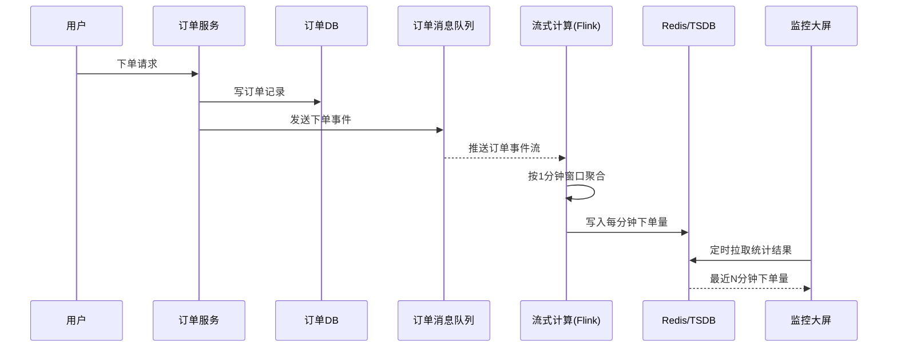
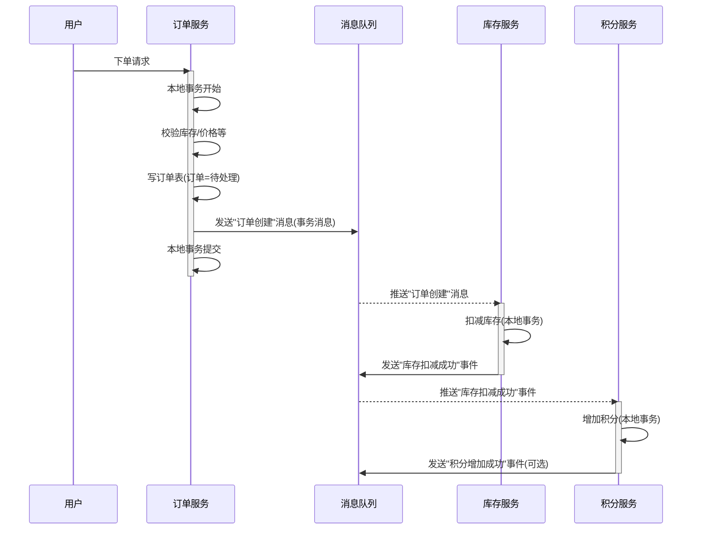
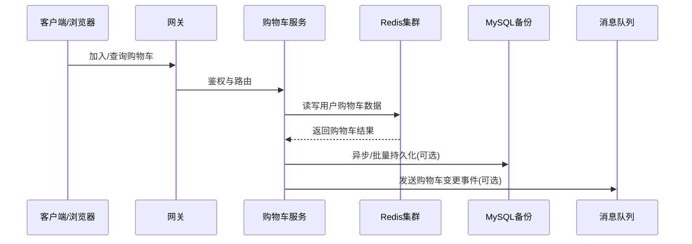
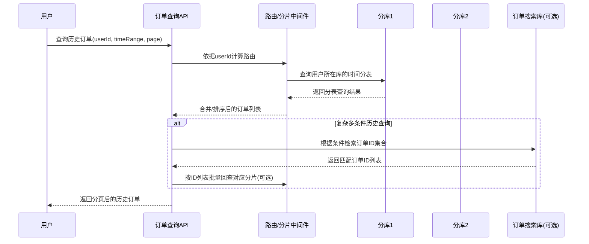
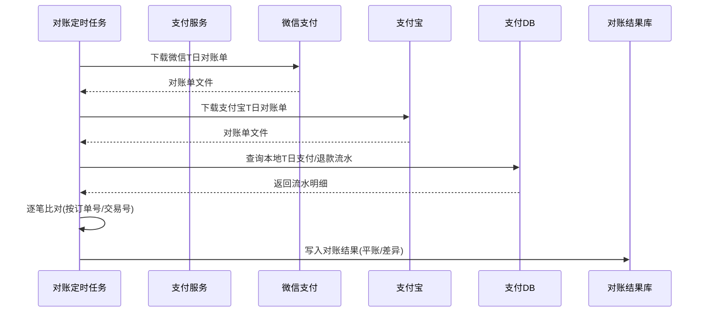
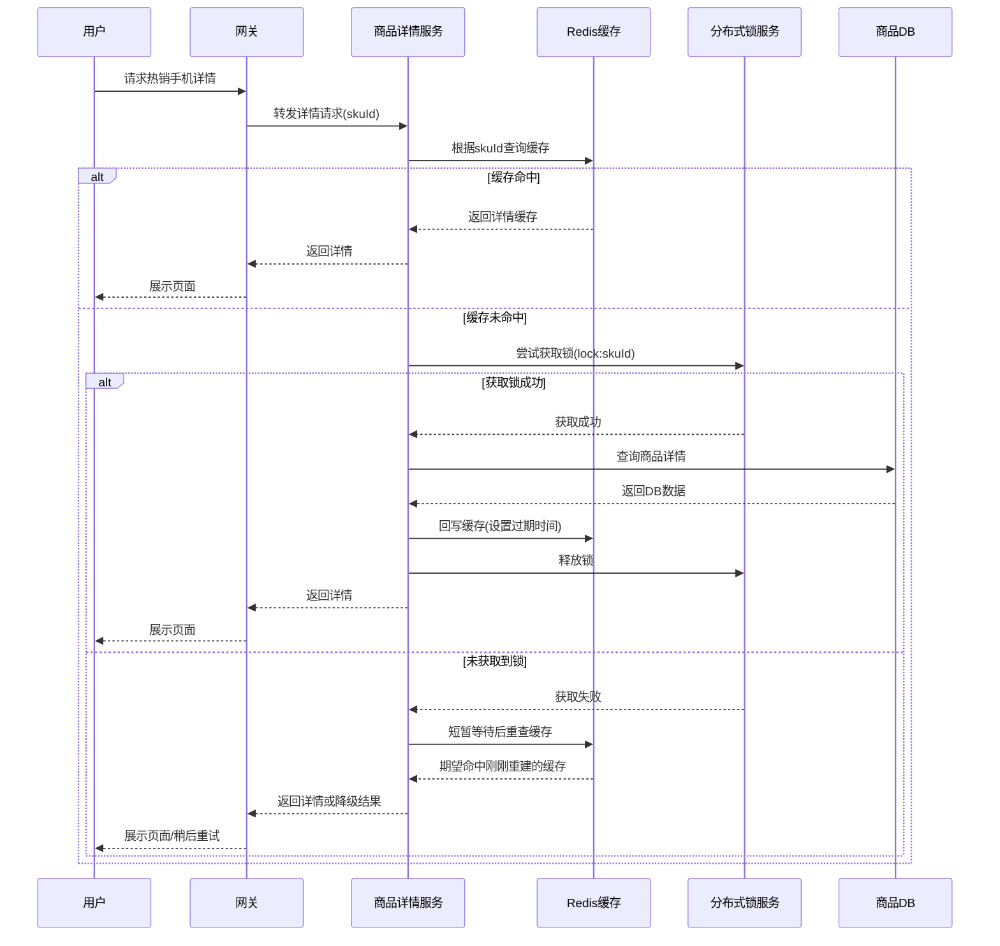
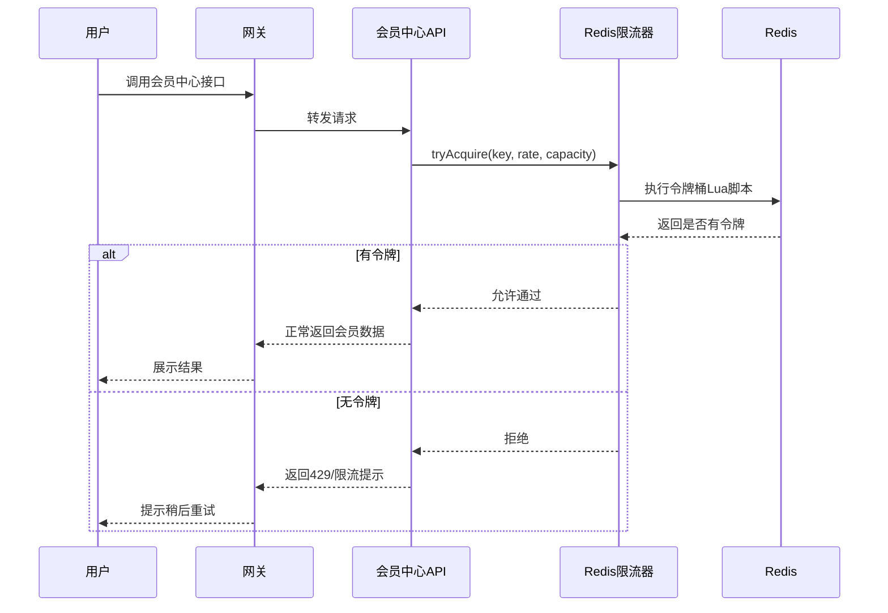
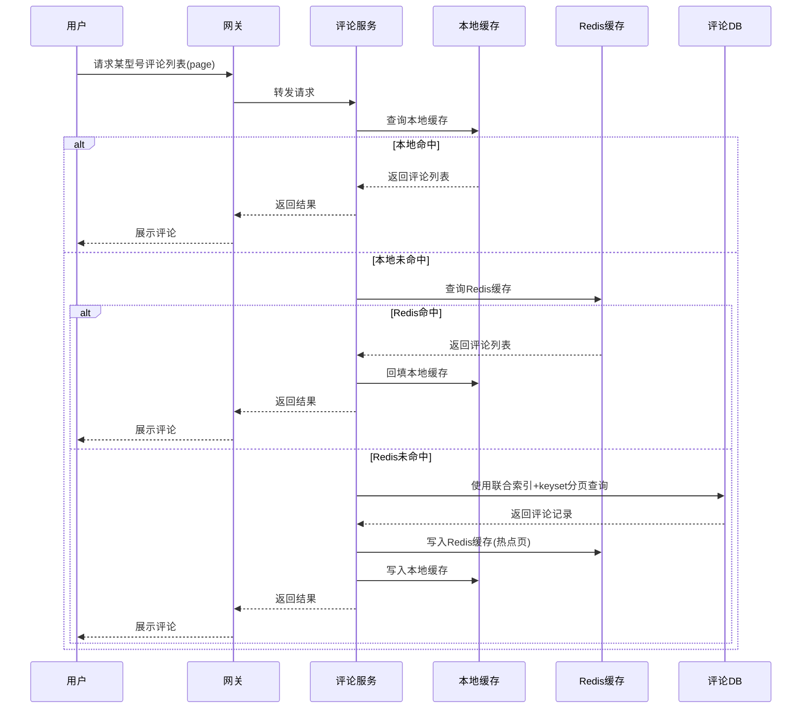
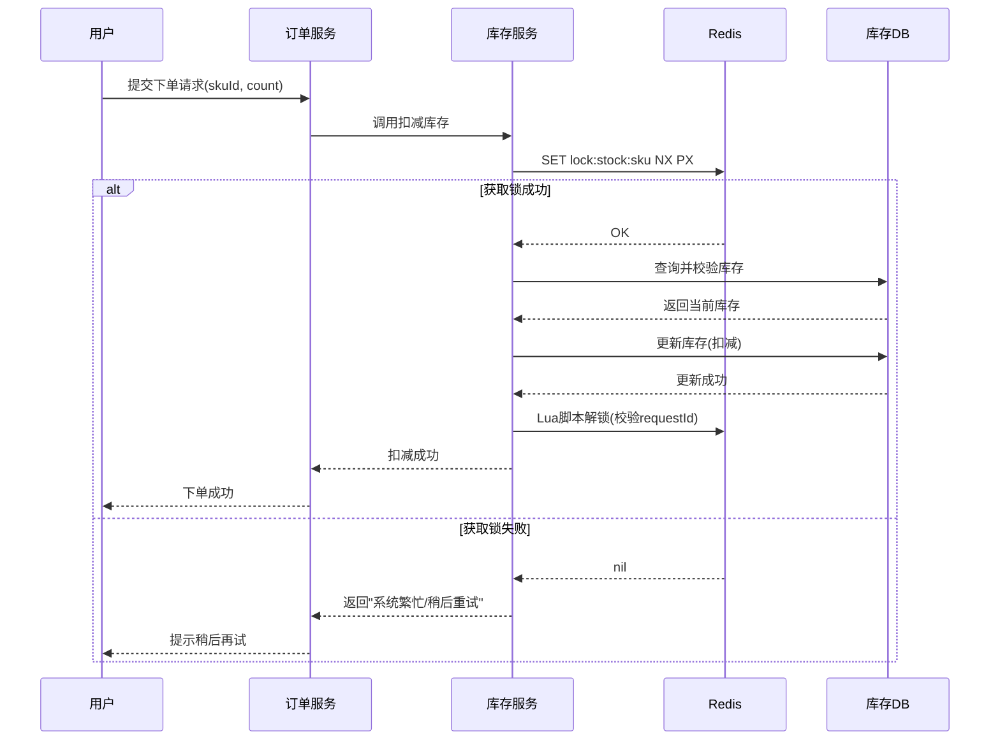

# Java 面试题汇总

> 本文档用于整理常见 Java 面试题及答案，由 AI 辅助生成。

---

后续每道题都会包含：
- 题目描述
- 详细答案与要点
- 如有需要，会使用 Mermaid 等形式画出结构/流程示意图（可在 VS Code 或 GitHub 直接预览）

下面开始记录你的第一个问题。

---

## 1. 如何实时统计 vivo 商城的每分钟下单量？

### 思路与总体方案

- **核心目标**：实时（或准实时）统计最近每分钟的下单量，用于看运营效果、监控流量突增、风控预警等。
- **关键点**：高并发下单写入、实时流式统计、按时间窗口聚合（每分钟）、低延迟可视化/查询。

整体可以采用「消息队列 + 流式计算 + 时序存储/缓存」的典型实时统计架构。

### 参考架构示意图（Mermaid）



### 关键技术点拆解

1. **订单服务产生事件**
   - 下单接口成功后（事务提交后），发送一条「订单已创建」事件到消息队列（如 Kafka、RocketMQ）。
   - 事件内容至少包含：订单 ID、用户 ID、下单时间（事件时间）、金额、渠道等。

2. **消息队列解耦 + 削峰**
   - 所有下单事件先进入 MQ，可以**平滑高并发写入**，并支持**多消费方**（统计、风控、推荐等）。
   - 通过分区机制实现水平扩展，保证吞吐。

3. **流式计算做「每分钟窗口聚合」**
   - 使用 Flink / Spark Streaming，消费订单事件流。
   - 按照订单事件时间（`orderTime`）做**滚动时间窗口**统计：
     - 滚动窗口：`1 min`，每分钟一条结果。
     - 若对延迟要求更高，可以结合**滑动窗口** + **预聚合**。
   - 处理乱序：使用**Watermark（水位线）**，允许一定程度的延迟事件（例如 2 分钟内的迟到订单仍然统计进对应分钟）。

4. **结果写入 Redis / 时序数据库**
   - 典型：Flink 聚合后将结果写入 Redis：
     - key：`order_stat:{yyyyMMddHHmm}`
     - value：该分钟的下单数量（及其他指标：GMV、成功支付数等）。
   - 也可以写入 InfluxDB、ClickHouse 之类的时序/分析型数据库，方便历史数据分析。

5. **对外提供实时查询/大屏展示**
   - 运营后台 / 监控大屏周期性（例如每 5s）从 Redis 拉取最近 N 分钟下单量绘图。
   - 也可以封装为一个统计服务 API，对外提供实时指标查询。

### 一个简化的 Flink 统计逻辑示意（伪代码）

```java
// 伪代码，仅体现核心思路
DataStream<OrderEvent> events = env
    .addSource(kafkaSource)
    // 指定事件时间字段
    .assignTimestampsAndWatermarks(
        WatermarkStrategy
            .<OrderEvent>forBoundedOutOfOrderness(Duration.ofMinutes(2))
            .withTimestampAssigner((event, ts) -> event.getOrderTime())
    );

events
    .keyBy(e -> 1) // 全局一个 key，统计总下单量；也可按渠道/城市等维度分 key
    .window(TumblingEventTimeWindows.of(Time.minutes(1)))
    .aggregate(new CountAgg())  // 自定义聚合函数，统计数量
    .addSink(redisSink);        // 写入 Redis（key=时间分钟，value=count）
```

### 可能的追问与优化点

- **如何应对流量高峰？**
  - MQ 分区扩容，Flink 并行度提升，订单服务水平扩展。
- **如何保证统计的准确性？**
  - 使用事件时间 + Watermark 处理乱序。
  - 对极端迟到数据做补偿机制（离线修正 + T+1 校准）。
- **如何支持多维度统计？**
  - 在流式计算中按不同维度 `keyBy`，分别聚合（如按渠道、城市、终端等）。

这类题目面试官通常希望你能说出：**消息队列解耦 + 流式计算（Flink）+ 时间窗口 + Redis/TSDB 存储 + 实时展示** 这一整套思路，并能讲清楚高并发、乱序事件和延迟的处理方式。

---

## 2. 用户下单时需要扣减库存、生成订单、增加积分，如何保证三个操作的事务一致性？

### 问题分析

涉及三个子系统或表：

- **订单服务**：创建订单记录
- **库存服务**：扣减商品库存
- **积分/账户服务**：给用户增加积分

如果在**同一个库、同一个服务内**，可以用本地事务解决；但在实际电商中，往往是**多个微服务 + 多个数据库**，这就变成了一个**分布式事务问题**。

### 情况一：单体/单库场景（本地事务）

若订单表、库存表、积分表在同一个数据库中，且由同一个应用服务操作：

- 使用 **Spring + 本地事务（`@Transactional`）**：
  - 一个方法内依次执行：扣库存 → 生成订单 → 增加积分。
  - 三个操作在**同一个数据库事务里**，要么都成功，要么都回滚。

```java
@Transactional
public void placeOrder(OrderRequest req) {
    stockService.deduct(req.getSkuId(), req.getCount());
    Order order = orderService.createOrder(req);
    pointService.addPoint(order.getUserId(), order.getAmount());
}
```

缺点：不利于服务拆分和水平扩展，是面试中「过于简单」但需要先提到的基础方案。

### 情况二：微服务/多库场景（分布式事务）

订单、库存、积分通常是三个微服务，对应三个库：

- 不能简单依赖数据库本地事务，需要**分布式事务或最终一致性方案**。

常见几种思路：

1. **TCC（Try-Confirm-Cancel）模式**
   - Try：预留资源（冻结库存，记录待确认积分）。
   - Confirm：订单创建成功后，确认扣减库存、正式加积分。
   - Cancel：订单失败时，释放库存，回滚积分。
   - 通过 TCC 框架（如 Seata TCC）协调多个服务的一致性。

2. **可靠消息 + 最终一致性（事务消息）**
   - 订单服务本地事务：创建订单 + 发送「订单创建成功」的消息（事务性发送）。
   - 库存服务订阅消息：扣减库存，成功后发送「库存扣减成功」消息。
   - 积分服务订阅相应事件：增加积分。
   - 若中间任何一步失败，通过重试/补偿保证**最终一致性**，而不是强一致。

3. **分布式事务框架（例如 Seata AT 模式）**
   - 通过全局事务 ID 协调多个服务，本质是两阶段提交 + 回滚日志。
   - 适合改造成本可接受、并且对强一致性有比较高要求的场景。

### 推荐方案：可靠消息 + 本地事务（最终一致性）

在高并发电商场景中，普遍推荐：

- **订单服务**内部使用本地事务保证「订单落库 + 发送消息」的一致性。
- **库存服务、积分服务**各自使用本地事务处理自己的业务，并订阅订单相关的领域事件。

#### 简化流程示意图（Mermaid 序列图）



要点：

- 每个服务内部依然使用**本地事务**确保自身数据一致。
- 服务之间通过**消息队列 + 重试机制**实现最终一致性，而不是用跨库事务锁住所有资源。

### 面试时可以这样组织回答

1. 先区分：**单体/单库** vs **微服务/多库**。
2. 单库场景：`@Transactional` 包住三步操作即可（顺便提一下隔离级别、回滚场景）。
3. 多库场景：这是一个典型**分布式事务问题**，常见有：
   - 2PC / XA（很少在高并发互联网场景落地，性能和可用性不好）。
   - TCC 模式（Try-Confirm-Cancel）。
   - 可靠消息 + 本地事务（最终一致性）。
   - 分布式事务框架（如 Seata AT/TCC/SAGA 等）。
4. 最后重点推荐：
   - 使用**可靠消息 + 本地事务**的方式：
     - 订单本地事务 + 发送订单事件。
     - 库存消费订单事件，本地扣减库存 + 发送扣减成功事件。
     - 积分消费库存成功事件，本地增加积分。
   - 通过补偿、重试机制保证最终一致性，兼顾性能与可用性.

---

## 3. vivo 商城购物车在促销期间访问量激增，如何设计高并发的购物车服务？

### 问题背景

- 促销期间用户频繁：加入购物车、修改数量、勾选/取消、查询购物车列表等操作。
- 购物车读请求远大于写请求，但在活动场景下**写也会很多**。
- 要求：
  - 高并发、高可用，不能成为下单入口的瓶颈。
  - 数据尽量准确，但可以接受**弱一致/最终一致**（如少量延迟写库）。

### 总体设计思路

- **核心思路**：
  - 购物车数据以**用户维度**分片，主要存储在 **Redis** 等内存缓存中。
  - 数据定期或按事件异步落地 MySQL，用于持久化和离线分析。
  - 通过**水平扩展 + 分布式缓存 + 限流降级**保证高并发.

### 购物车架构示意图（Mermaid）



### 关键设计点拆解

1. **数据模型与存储选择**
   - 按 `userId` 将购物车保存在 Redis：
     - 可以使用 **Hash**：`cart:{userId}` → field=`skuId`，value=`{count, checked, priceSnapshot...}`.
     - 或者使用 **Sorted Set/List** 保存按时间排序的条目.
   - Redis 设置**合理过期时间**（如 30 天未访问自动过期）。
   - 定期或在重要操作（如下单）时，将购物车部分数据持久化到 MySQL.

2. **读写策略（读多写少优化）**
   - **读操作**（查询购物车）：
     - 绝大部分从 Redis 读取，避免打 MySQL.
     - 可在应用层聚合价格、库存状态（通过商品服务/库存服务接口）。
   - **写操作**（加车、删减数量、勾选）：
     - 直接对 Redis 进行原子操作（`HINCRBY`, `HSET`, `HDEL` 等）。
     - 关键路径尽量只操作缓存，**异步写库**（通过 MQ 或后台任务）。

3. **并发控制与一致性**
   - 同一个用户购物车一般只会被这个用户同时操作：
     - Redis 操作基于 key 的原子性，通常不需要复杂分布式锁.
   - 极端情况下（多端同时操作同一账号）：
     - 可以用 `WATCH + MULTI/EXEC` 或基于 Lua 脚本保证操作原子性.
   - 对价格、库存的一致性：
     - 购物车中保存的是**快照信息**（加入时的价格）。
     - 真正下单时再由订单服务去校验**实时价格和库存**，购物车只做展示.

4. **高并发与扩展性**
   - 购物车服务本身：
     - 使用 **无状态服务**，通过 Kubernetes/Nacos 等实现水平扩展.
   - Redis：
     - 使用 Redis Cluster / Codis 等支持分片和高可用.
     - 根据 `userId` 做哈希分片，避免热点集中在单节点.
   - 数据库：
     - MySQL 作为持久化备份，可做读写分离；但请求量远小于 Redis.

5. **限流、降级与容灾**
   - 在促销大流量场景：
     - 网关层和购物车服务增加**限流**，防止被打挂.
     - 对部分非关键接口做**降级**：例如只返回精简购物车数据，不实时查库存/优惠信息.
   - Redis 挂掉或网络异常时：
     - 可以短暂回退到「只读 MySQL」模式或提示稍后重试，避免系统整体雪崩.

6. **缓存穿透/击穿/雪崩问题**
   - 穿透：对不存在用户/购物车的请求，可写入一个空标记，短期缓存避免频繁打 DB.
   - 击穿：对大促期间某些大 V 用户，采用本地缓存 + 互斥锁，避免同一 key 被并发打爆.
   - 雪崩：随机过期时间、分散失效时间点，配合多级缓存策略.

### 面试时的回答结构建议

1. 先明确：促销期购物车是**高并发读写场景**，核心是“快”和“稳”.
2. 再给出**总体方案**：
   - Redis 作为主存，MySQL 作为落地备份.
   - 购物车服务无状态部署 + 水平扩展.
3. 然后拆关键点：
   - 数据模型（按 userId 存，Hash/Sorted Set）。
   - 读写路径（读 Redis、写 Redis 异步落库）。
   - 并发控制（以用户为粒度，Redis 原子操作即可）。
   - 限流、降级、熔断等稳定性设计.
4. 最后简单提一下可能的优化：本地缓存、多级缓存、冷热数据分离等.

---

## 4. 订单表数据量已达亿级，如何设计分库分表策略？如何解决用户查询历史订单时的跨分片查询问题？

### 分库分表总体思路

目标：

- 单表数据量控制在**千万级以内**，减少索引长度、提升查询和写入性能。
- 通过**水平拆分（分库分表）**实现扩容。
- 避免用户「查自己历史订单」时跨太多分片。

一个常见、易讲清的方案：

1. **按用户维度分库**：
   - 使用 `user_id` 做路由键，例如：`db_index = user_id % N`.
   - 同一用户的订单只落在一个库中，用户查自己的历史订单**不会跨库**.
2. **按时间或 hash 分表**：
   - 每个库中，再按**月份/季度**或 `order_id` hash 进行分表：
     - 表名形如：`order_202401`、`order_202402`，或 `order_0 ... order_15`.
   - 既保证单表数据量可控，又方便按时间范围查询.
3. **主从或多副本**：
   - 每个分库做主从复制，主库写、从库读，保证高并发读能力.

同时需要：

- 统一的**分片中间件**（如 ShardingSphere、mybatis-interceptor 自研路由组件），屏蔽路由细节.
- **全局唯一订单号**（如雪花算法 Snowflake）以支持多库并发写入而不冲突.

### 用户查询历史订单：尽量避免跨分片

核心想法：

- **路由键选得好**，用户自己的订单基本都在同一分片上.
  - 例如按 `user_id` 分库分表，那么「用户 A 查自己的全部订单」只需要访问一个库中的有限几张表.
- 若再按时间维度拆表：
  - 查询最近 3 个月订单，只需命中当前库中的 3 张（或少量）时间分表，而不是所有分表.

查询流程示意：

1. 前端传入 `userId + 时间范围 + 分页参数`.
2. 分片路由组件根据 `userId` 计算所在库，再根据时间范围选择需要访问的几张分表.
3. 在选定的几张分表中做 `UNION ALL + ORDER BY + LIMIT` 或分批查询，再在业务层做结果合并与分页.

### 仍然需要跨分片时的几种解决方式

在某些场景（如**运营后台全站搜索订单**、风控/风控规则校验）下，确实需要跨分片：

1. **应用层聚合**：
   - 由查询服务并行地向所有分片发起查询（可以开线程池/异步调用），然后在应用层合并结果、排序、分页.
   - 适合数据量不算极端、实时性要求一般的运营类查询.

2. **构建搜索/分析库**：
   - 将订单数据通过 binlog/Kafka 等**实时同步到 ES/ClickHouse/HBase** 等搜索或分析引擎.
   - 用户复杂条件查询、导出大量历史订单时，直接查搜索库，而不是 OLTP 分库系统.

3. **分层存储：冷热分离**：
   - 近期订单（如 3~6 个月）保留在在线库的高性能分片中；
   - 更老的订单归档到归档库或大数据平台，通过单独的历史订单查询入口访问.

### 一个分库分表 + 查询的时序图（Mermaid）



### 面试回答结构建议

1. 先说明：亿级数据量下，单表会带来的问题（索引膨胀、慢查询、备份恢复慢）。
2. 给出一个**清晰的分库分表策略**：`userId` 分库 + 时间/Hash 分表，并强调：
   - 同一用户在同一分库，避免用户查询时跨库.
3. 再回答「跨分片查询」：
   - 对于用户查自己订单，通过路由避免跨库；
   - 对于运营/统计类的全局查询，应用层并行聚合或接 ES/数仓.
4. 最后补充：分片中间件、全局 ID、冷热分离、归档等工程细节.

---

## 5. 如何实现 vivo 商城与第三方支付渠道（微信/支付宝）的每日对账系统？

### 目标与整体思路

- 确保「**平台账**」（订单/支付系统）与「**支付渠道账**」（微信/支付宝）的一致性.
- 发现并定位：少记、多记、金额不一致、重复支付、漏退款等问题.
- 对账通常采用 **T+1 每日批量对账**，必要时配合实时对账告警.

总体方案：

1. 平台侧要有**完整的支付流水表**（支付、退款、关闭等）。
2. 每天固定时间从第三方支付渠道**下载对账单文件**。
3. 将本地流水与渠道对账单按 `商户订单号/交易号` 逐笔比对。
4. 生成对账结果（平账/不平账），落库并产出报表，驱动后续人工或自动处理.

### 平台数据准备

- 设计本地支付流水表，例如：`payment_trade`：
  - `merchant_order_no`（商户订单号，对应商城订单）
  - `channel_trade_no`（第三方支付交易号）
  - `user_id`、`amount`、`currency`、`status`（SUCCESS/CLOSE/REFUND...）
  - `pay_time`、`channel`（WECHAT/ALIPAY）
  - `refund_amount`、`fee` 等字段
- 支付、退款流程中**必须保证流水记录完整且不可随意修改**（只能追加状态）。

### 每日对账流程

- 定时任务（如每天 1:00）触发：
  1. 对于每个支付渠道（微信/支付宝），调用其接口下载 T 日对账单文件（一般为 CSV/压缩包）。
  2. 将对账单解析后导入临时表 `channel_bill_tmp`，包含：
     - 渠道订单号、商户订单号、金额、手续费、交易状态、完成时间等。
  3. 从本地 `payment_trade` 中查询同一时间范围内的流水。
  4. 按 `商户订单号` 或 `渠道订单号` 进行 **左/右/全外连接** 比对：
     - 双方都有且金额/状态一致 → **平账**。
     - 仅本地有 → 本地多记/渠道未确认（可能未支付成功或上传失败）。
     - 仅渠道有 → 渠道多记（可能回调丢失、重试导致多次支付）。
     - 双方都有但金额/状态不一致 → 金额不符或状态不同。
  5. 将结果写入 `reconciliation_result` 表，并生成对账报表（CSV/Excel）。

### 对账流程时序图（Mermaid）



### 差异处理与告警

- 对于「差异记录」，可以分类型处理：
  - 渠道有、本地无：查明是否回调丢失，必要时补记本地订单或发起退款。
  - 本地有、渠道无：检查是否未真正扣款或订单状态异常，按业务规则冲正/关闭。
  - 金额/状态不符：人工介入核查，必要时与渠道技术/商务沟通。
- 建立**告警机制**：
  - 差异条数或金额超过阈值时，自动发短信/钉钉/企微通知.

### 面试回答结构建议

1. 先说清目标：保证平台账与渠道账一致，发现多收/少收/漏记等问题.
2. 再讲整体流程：T+1 定时任务 → 下载渠道对账单 → 本地流水查询 → 按订单号逐笔比对 → 生成对账结果和报表.
3. 说明关键设计：
   - 本地支付流水表设计完整.
   - 对账单落临时表再比对，避免一次性全量在内存中处理.
   - 对账结果表 + 差异分类，支持后续处理.
4. 最后补充：告警机制、安全（文件加密、权限控制）、重跑机制（对账失败可重新跑一次）等工程细节.

---

## 6. vivo 热销手机详情页缓存失效时，如何避免瞬时大量请求直接打到数据库？

### 问题背景

- 热销机型详情页是**强热点**，QPS 很高.
- 如果缓存（如 Redis）在某一刻失效：
  - 所有请求同时打到 DB，容易**打爆数据库**，形成「缓存击穿」.

核心要解决：在缓存失效或重建时，仍然要**保护数据库**，让同一时间只有极少数请求能访问 DB，其它请求走缓存或等待.

### 总体思路

常见的防护思路可以组合使用：

1. **互斥锁/单飞（SingleFlight）重建缓存**：
   - 缓存 miss 时，只有拿到分布式锁的请求去查 DB + 重建缓存，其它请求要么等待，要么直接返回旧数据.
2. **逻辑过期 + 异步刷新**：
   - 缓存里存「数据 + 逻辑过期时间」.
   - 过期后，读请求仍然先返回旧数据，同时由少量线程在后台异步刷新缓存，避免大量请求一起打 DB.
3. **多级缓存**：
   - 本地缓存（Caffeine/Guava）+ Redis，极热点数据优先命中本地缓存.
4. **限流与降级**：
   - 在缓存完全不可用且 DB 压力大时，对详情页接口限流或降级（例如只返回核心信息、或提示稍后重试）。

下面重点讲两种比较常问的方案：**互斥锁重建缓存** 和 **逻辑过期 + 异步刷新**.

### 方案一：互斥锁防止缓存击穿

流程：

1. 请求先查 Redis：
   - 如果命中，直接返回.
2. 未命中时，尝试获取一个针对该商品的**分布式锁**，如 `lock:sku:{id}`：
   - 拿到锁：去 DB 查询数据，写入缓存，释放锁.
   - 没拿到锁：
     - 可以短暂休眠后重试查缓存；
     - 或直接返回「稍后重试」/降级结果.

简单示例逻辑（伪代码）：

```java
public ProductDetail getDetail(Long skuId) {
    String cacheKey = "prod:detail:" + skuId;
    String json = redis.get(cacheKey);
    if (json != null) return deserialize(json);

    String lockKey = "lock:prod:detail:" + skuId;
    if (!redis.setIfAbsent(lockKey, "1", 30, SECONDS)) {
        // 未拿到锁，稍后重试或直接返回
        Thread.sleep(50);
        json = redis.get(cacheKey);
        if (json != null) return deserialize(json);
        throw new TooBusyException();
    }

    try {
        // 双检，防止重复查询
        json = redis.get(cacheKey);
        if (json != null) return deserialize(json);

        ProductDetail dbData = queryDb(skuId);
        redis.set(cacheKey, serialize(dbData), 5, MINUTES);
        return dbData;
    } finally {
        redis.del(lockKey);
    }
}
```

### 方案二：逻辑过期 + 异步刷新

- 缓存 value 中包含字段：`data` + `logicExpireTime`.
- 读取时：
  - 若当前时间 < `logicExpireTime` → 直接返回缓存数据.
  - 若已过期：
    - 仍旧返回旧数据（避免请求打 DB）；
    - 同时尝试获取一个刷新锁，由后台线程异步从 DB 拉新数据，写回缓存.

这样可以做到：**用户始终有数据可看**，同时只有少数线程在后台刷新缓存，保护数据库.

### 热点详情页请求的保护时序图（Mermaid）



### 面试回答结构建议

1. 先点明这是典型的**缓存击穿**问题（热点 key 失效导致 DB 被打爆）。
2. 给出总体方案：
   - 互斥锁/SingleFlight 控制只有一个请求去重建缓存；
   - 逻辑过期 + 异步刷新，用户始终有数据看；
   - 多级缓存、限流和降级作为兜底.
3. 简单展开一个你最熟悉的实现方式（比如基于 Redis 分布式锁的互斥重建），适当提及双检、锁超时等工程细节.

---

## 7. 设计一个针对 vivo 会员中心 API 的限流方案，要求支持突发流量（如会员日），给出具体实现代码

### 目标与场景

- 会员中心 API（如查询会员等级、成长值、权益）在「会员日」等活动期间会出现**突发流量**。
- 需要在**保证核心服务可用**的前提下，对接口进行限流：
  - 防止下游服务和数据库被打挂；
  - 允许一定的**短时突发（burst）**，用户体验不要太差。

### 总体限流方案设计

多层限流思路：

1. **网关层限流（Nginx / Spring Cloud Gateway）**
   - 按 API、IP、应用维度进行**粗粒度限流**。
   - 使用令牌桶算法（Token Bucket）：允许平滑限流 + 一定突发。
2. **服务内部限流（会员中心服务）**
   - 按用户维度、接口维度进行**细粒度限流**。
   - 使用 Redis + Lua 实现**分布式令牌桶**，多实例共享限流状态。
3. **针对会员日的动态限流配置**
   - 通过配置中心（如 Nacos）动态下发某些 API 的最大 QPS、桶容量（burst 大小）。
   - 活动期间可以适当放宽限流，但仍有上限，防止雪崩。

下面给出一个在 Spring Boot 中使用 **Redis + Lua 令牌桶** 的示例实现。

### Redis 令牌桶限流思路

- 对每个限流 key（例如 `member:api:vipInfo` 或 `member:api:vipInfo:user:{id}`）：
  - 维护：
    - `tokens`：当前剩余令牌数；
    - `timestamp`：上次填充令牌的时间戳。
- 每次请求：
  1. 根据当前时间计算应该补充多少令牌（`(now - lastTime) * rate`），上限为桶容量 `capacity`。
  2. 如果补充后 `tokens > 0`，则消费 1 个令牌，允许通过。
  3. 否则限流（返回 429 或自定义错误码）。
- 以上逻辑都在一段 Lua 脚本中完成，保证原子性。

### Java 示例代码：基于 Redis + Lua 的简单限流器

> 说明：以下代码偏伪代码/示例，重点是体现**参数设计和调用方式**，实际项目中可封装为 Spring AOP 注解。

```java
// Lua 脚本示意（可放在资源文件中加载）：
// KEYS[1] = 限流 key
// ARGV[1] = 当前时间戳(毫秒)
// ARGV[2] = 填充速率(每秒生成多少令牌)
// ARGV[3] = 桶容量

// 返回值：1-放行；0-限流

String LUA_TOKEN_BUCKET = "" +
    "local key = KEYS[1]\n" ..
    "local now = tonumber(ARGV[1])\n" ..
    "local rate = tonumber(ARGV[2])\n" ..
    "local capacity = tonumber(ARGV[3])\n" ..
    "local tokens_key = key .. ':tokens'\n" ..
    "local ts_key = key .. ':ts'\n" ..
    "local tokens = tonumber(redis.call('get', tokens_key)) or capacity\n" ..
    "local last_ts = tonumber(redis.call('get', ts_key)) or now\n" ..
    "local delta = math.max(0, now - last_ts) / 1000.0\n" ..
    "local filled = math.min(capacity, tokens + delta * rate)\n" ..
    "if filled < 1 then\n" ..
    "  redis.call('set', tokens_key, filled)\n" ..
    "  redis.call('set', ts_key, now)\n" ..
    "  return 0\n" ..
    "else\n" ..
    "  redis.call('set', tokens_key, filled - 1)\n" ..
    "  redis.call('set', ts_key, now)\n" ..
    "  return 1\n" ..
    "end\n";

@Component
public class RedisRateLimiter {

    @Resource
    private StringRedisTemplate stringRedisTemplate;

    private final DefaultRedisScript<Long> script;

    public RedisRateLimiter() {
        this.script = new DefaultRedisScript<>();
        script.setResultType(Long.class);
        script.setScriptText(LUA_TOKEN_BUCKET);
    }

    /**
     * @param key       限流 key，如 member:api:vipInfo
     * @param rate      每秒生成多少令牌（平滑 QPS）
     * @param capacity  桶容量（最大突发请求数）
     */
    public boolean tryAcquire(String key, double rate, int capacity) {
        long now = System.currentTimeMillis();
        List<String> keys = Collections.singletonList(key);
        Long result = stringRedisTemplate.execute(
                script,
                keys,
                String.valueOf(now),
                String.valueOf(rate),
                String.valueOf(capacity)
        );
        return result != null && result == 1L;
    }
}

// 在会员中心 Controller 或 AOP 中使用
@RestController
@RequestMapping("/api/member")
public class MemberController {

    @Resource
    private RedisRateLimiter rateLimiter;

    @GetMapping("/info")
    public ResponseEntity<?> getMemberInfo(@RequestHeader("X-User-Id") Long userId) {
        String key = "member:api:info"; // 也可以附带 userId 做更细粒度控制

        // 正常日：rate=1000, capacity=2000; 会员日可通过配置中心调大
        boolean allowed = rateLimiter.tryAcquire(key, 1000.0, 2000);
        if (!allowed) {
            return ResponseEntity.status(429).body("too many requests, please try later");
        }

        // 这里调用会员中心核心逻辑
        // MemberInfo info = memberService.getInfo(userId);
        return ResponseEntity.ok("member info");
    }
}
```

### 限流方案时序图（Mermaid）



### 面试回答结构建议

1. 先说明：会员中心是高价值接口，会员日会出现突发流量，需要多层限流保护.
2. 给出整体方案：网关层限流 + 服务内 Redis 分布式令牌桶 + 动态配置限流参数.
3. 选一种实现（如 Redis + Lua 令牌桶）详细展开：参数含义、如何支持突发（capacity）以及如何在 Spring 中落地（拦截器/AOP）.
4. 可再补充用户级限流、防刷限流、白名单客户端、监控告警等工程细节.

---

## 8. vivo 活动页服务频繁 Full GC，如何通过 JVM 参数和代码优化解决？

### 问题背景

- 活动页（大促页/专题页）在活动期间访问量极高，页面渲染常常伴随大量 JSON 解析、模板渲染、拼装 VO 等操作.
- 线上监控发现：
  - Full GC 频繁（如几秒一次），导致明显的 STW 卡顿；
  - 响应时间偶发抖动，甚至超时.

需要从两方面入手：

- **JVM 参数调优**：合理设置堆大小、GC 算法与相关参数，减少 Full GC 触发频率.
- **代码级优化**：减少对象分配、避免内存泄漏与无界缓存，降低 GC 压力.

### 一、可能导致频繁 Full GC 的常见原因

1. **堆过小或老年代空间不足**
   - 大量短命对象晋升到老年代，或老年代碎片严重，触发 `Full GC (Allocation Failure)`.
2. **大对象/巨型集合使用不当**
   - 活动页一次请求构建很多大集合、字符串拼接产生大量临时对象.
3. **缓存/集合无界增长（内存泄漏）**
   - `Map`, `List`, `ConcurrentHashMap` 等做本地缓存，没有上限/过期策略.
4. **不合适的 GC 算法或默认参数不匹配业务**
   - 如堆太小、暂停时间指标过紧导致频繁 GC.

### 二、JVM 参数优化方向（以 G1 GC 为例）

假设运行环境为 JDK 11+/17+/21，默认 GC 为 G1，可考虑：

1. **合理设置堆大小，避免频繁扩容**

```bash
-Xms4g -Xmx4g          # 设置初始堆和最大堆一致，避免运行中多次扩容
```

2. **调整暂停时间目标与 G1 行为**

```bash
-XX:+UseG1GC                           # 显式使用 G1（新版本默认）
-XX:MaxGCPauseMillis=200               # 目标最大停顿时间，视 SLA 调整
-XX:InitiatingHeapOccupancyPercent=45  # 老年代占用到 45% 触发并发标记
```

3. **打印 GC 日志用于分析**

```bash
-Xlog:gc*,safepoint:file=logs/gc.log:time,uptime,level,tags
```

在 GC 日志中注意观察：

- Full GC 的**原因**（Allocation Failure / Metadata GC Threshold / System.gc 等）.
- 老年代使用率是否长期接近 100%，是否存在 Promotion Failure.

必要时可以：

- 适当**增大堆**或调整新生代/老年代比例；
- 若业务以低延迟为主，可考虑 ZGC/Shenandoah（视 JDK 版本和生产策略而定）。

### 三、代码级优化思路

1. **减少临时对象创建**
   - 尽量复用对象，避免在热点路径上频繁 `new`：
     - 复杂 JSON 序列化/反序列化避免多次中间转换；
     - 字符串拼接使用 `StringBuilder`/预分配缓冲区.
   - 避免在循环中创建大对象，例如：

```java
// 反例：每次请求/每条记录都 new 格式化器
for (Activity a : list) {
    SimpleDateFormat sdf = new SimpleDateFormat("yyyy-MM-dd HH:mm:ss");
    String s = sdf.format(a.getStartTime());
}

// 改进：复用线程安全或 ThreadLocal 对象
private static final DateTimeFormatter FMT = DateTimeFormatter.ofPattern("yyyy-MM-dd HH:mm:ss");
for (Activity a : list) {
    String s = FMT.format(a.getStartTime());
}
```

2. **控制本地缓存和集合大小**
   - 使用带容量上限和过期策略的缓存（如 Caffeine/Guava Cache），避免无界 Map.
   - 定期清理过期活动数据，避免历史活动长期占用内存.

3. **避免内存泄漏模式**
   - ThreadLocal 使用后要适时 `remove()`；
   - 事件监听器、回调等要在不再使用时注销；
   - 避免把大对象放在静态集合中长期不释放.

4. **分离冷数据与热数据**
   - 热点数据（当日活动配置）尽量放入 Redis 等缓存；
   - JVM 内仅保留必要的元数据引用，减轻堆压力.

### 四、活动页请求与 GC 的时序示意（Mermaid）

```mermaid
sequenceDiagram
    participant U as 用户
    participant G as 网关
    participant S as 活动页服务
    participant H as JVM堆
    participant GC as GC线程

    U->>G: 请求活动页
    G->>S: 转发请求
    S->>H: 分配大量临时对象(渲染/拼装)
    H-->>GC: 堆使用率升高
    GC-->>S: 触发Young/Full GC, STW
    S-->>G: 响应时间抖动

    Note over S,H: 通过减少临时对象 & 做好缓存复用, 堆压力下降
    Note over GC: 调优G1参数, 降低Full GC频率

---

## 9. 用户评论表按手机型号分页查询缓慢，如何优化？从索引、SQL、缓存多角度分析

### 问题背景

- 有一张用户评论表 `t_comment`，主要字段示例：
  - `id`（主键）、`phone_model_id`（手机型号）、`user_id`、`score`、`content`、`create_time` 等。
- 典型查询：

```sql
SELECT *
FROM t_comment
WHERE phone_model_id = ?
ORDER BY create_time DESC
LIMIT ?, ?;
```

- 问题：数据量大时（某热门机型有几百万条评论），分页越往后越慢，甚至出现慢查询，影响详情页加载。

需要从 **索引设计、SQL 写法、缓存与架构** 多方面优化。

### 一、索引设计优化

1. **建立合适的联合索引**

```sql
CREATE INDEX idx_comment_model_time
ON t_comment(phone_model_id, create_time DESC, id);
```

- 查询条件中包含 `phone_model_id`，排序字段是 `create_time`，可以利用联合索引顺序扫描，避免回表或大范围排序。
- 根据实际查询列，考虑做**覆盖索引**（把经常查询的字段都放入索引中或使用包含列）。

2. **避免在 where/order by 中对索引列做函数/表达式**

- 比如 `DATE(create_time) = ?` 会使索引失效，应改为使用时间范围：

```sql
WHERE phone_model_id = ?
  AND create_time >= ?
  AND create_time < ?
```

3. **必要时按机型或时间分区/分表**

- 极端热点机型可以做**单独分表**或分区表，减少每表数据量。

### 二、SQL 与分页方式优化

1. **避免深度 OFFSET 分页（越翻越慢）**

传统写法：

```sql
... ORDER BY create_time DESC LIMIT 100000, 20;  -- 非常慢
```

改为**基于游标（keyset）分页**：

```sql
-- 第一页
SELECT *
FROM t_comment
WHERE phone_model_id = ?
ORDER BY create_time DESC, id DESC
LIMIT 20;

-- 下一页：带上上一页最后一条记录的 create_time 和 id
SELECT *
FROM t_comment
WHERE phone_model_id = ?
  AND (create_time < ? OR (create_time = ? AND id < ?))
ORDER BY create_time DESC, id DESC
LIMIT 20;
```

- 这样可以利用联合索引顺序扫描，不需要跳过前 N 万行，尾页性能也稳定。

2. **只查必要字段，避免 SELECT ***

- 对详情页评论列表，通常只需要：评分、昵称、时间、部分内容等。
- 先查精简字段列表，必要时再按 `id` 批量回表查询详情。

3. **合理控制排序与过滤条件**

- 避免复杂的 `like '%xxx%'` + 排序组合直接在主库做，可以引入搜索引擎（ES）来支持复杂检索。

### 三、缓存与架构层面的优化

1. **按机型 + 分页维度缓存评论列表**

- 使用 Redis 缓存热点机型的前 N 页评论：
  - key 示例：`comment:list:{phoneModelId}:{pageNo}`。
  - 值为该页评论的 JSON 列表，设置合理过期时间（如 1~5 分钟）或更新策略（新增评论时失效前几页）。
- 对于热门机型，大部分用户只看前几页，命中率高，极大减轻数据库压力。

2. **使用本地缓存作为一级缓存**

- 在应用内用 Caffeine 做短期缓存 + Redis 做二级缓存：
  - 减少同一 JVM 内重复反序列化和网络 IO。

3. **读写分离与只读实例**

- 评论写入主库，分页查询优先走只读从库或只读实例。
- 结合上面的缓存策略，数据库主要承担缓存 miss 和尾页等少量请求。

4. **冷热数据分层**

- 热点机型（最近发布、销量高）评论列表重点缓存与优化；
- 老机型评论可考虑归档或降低展示优先级，仅在用户主动翻页时才查。

### 四、整体查询流程示意图（Mermaid）



### 面试回答结构建议

1. 先从 **索引** 入手：说明为典型「按型号 + 时间排序分页」场景，需要联合索引 `(phone_model_id, create_time, id)`。 
2. 然后讲 **SQL 优化**：避免深度 OFFSET，改为 keyset 分页，只查必要字段。 
3. 再讲 **缓存与架构**：多级缓存（本地 + Redis）、按机型+页缓存列表、读写分离和冷热数据策略。 
4. 最后可以补充：根据慢 SQL 日志和执行计划（`EXPLAIN`）验证优化效果，并在压测环境下对比前后延迟和 QPS.

---

## 10. 如何实现 vivo 库存系统的分布式锁？

### 问题背景

- vivo 库存系统通常是多个实例集群部署，可能还有多个服务（下单服务、库存服务、活动服务）同时操作同一 `sku` 的库存。
- 若只依赖数据库更新语句而没有合适的并发控制，容易出现：
  - **超卖**：多个请求几乎同时读取旧库存，都认为库存充足然后各自扣减；
  - 数据不一致：部分请求更新失败/回滚，逻辑变复杂。

需要一个**跨进程、跨机器**都生效的分布式锁来串行化同一商品的库存扣减操作（或至少在热点场景下做强控制）。

### 总体思路

- 锁粒度：**按商品维度加锁**，例如 `lock:stock:{skuId}`，避免全局大锁成为瓶颈。
- 典型实现方案：
  1. Redis 分布式锁（`SET NX PX` + Lua 解锁）——实现简单、性能高，适合库存这种短持有锁场景；
  2. Redisson 提供的 `RLock` 封装；
  3. 基于 ZooKeeper 的分布式锁（这里可以简单提一下，不展开代码）。

下面重点说明 Redis 方案和一个简单的 Java 示例。

### Redis 分布式锁设计

1. **加锁**

```text
SET lock:stock:{skuId} {requestId} NX PX 30000
```

- `lock:stock:{skuId}`：锁 key，按 sku 粒度；
- `{requestId}`：本次请求生成的随机 UUID，用来防止误删其他线程持有的锁；
- `NX`：仅当 key 不存在时才设置（保证互斥）；
- `PX 30000`：锁过期时间（毫秒），防止持锁线程异常退出导致死锁。

若返回 `OK` 表示获取锁成功，否则说明已被其他线程持有。

2. **解锁（Lua 脚本保证原子性）**

解锁时必须先判断锁是否仍然属于自己（值相等），再删除 key，以防误删别人刚拿到的锁：

```lua
if redis.call('get', KEYS[1]) == ARGV[1] then
  return redis.call('del', KEYS[1])
else
  return 0
end
```

### Java 示例：基于 Spring + RedisTemplate 的简单库存分布式锁

```java
@Component
public class RedisLockService {

    @Resource
    private StringRedisTemplate stringRedisTemplate;

    private static final String UNLOCK_LUA =
            "if redis.call('get', KEYS[1]) == ARGV[1] then " +
            "return redis.call('del', KEYS[1]) " +
            "else return 0 end";

    private final DefaultRedisScript<Long> unlockScript;

    public RedisLockService() {
        this.unlockScript = new DefaultRedisScript<>();
        unlockScript.setResultType(Long.class);
        unlockScript.setScriptText(UNLOCK_LUA);
    }

    public String tryLock(String key, long expireMillis) {
        String requestId = UUID.randomUUID().toString();
        Boolean ok = stringRedisTemplate.opsForValue()
                .setIfAbsent(key, requestId, Duration.ofMillis(expireMillis));
        return Boolean.TRUE.equals(ok) ? requestId : null;
    }

    public void unlock(String key, String requestId) {
        stringRedisTemplate.execute(unlockScript,
                Collections.singletonList(key),
                requestId);
    }
}

// 库存扣减示例
@Service
public class StockService {

    @Resource
    private RedisLockService lockService;

    @Resource
    private StockRepository stockRepository; // 假设是 JPA / MyBatis 接口

    public void deductStock(Long skuId, int count) {
        String lockKey = "lock:stock:" + skuId;
        String lockId = lockService.tryLock(lockKey, 30_000);
        if (lockId == null) {
            throw new RuntimeException("系统繁忙, 请稍后重试");
        }
        try {
            // 在锁保护下执行库存校验 + 扣减
            Stock stock = stockRepository.selectForUpdate(skuId); // 或乐观锁
            if (stock.getAvailable() < count) {
                throw new RuntimeException("库存不足");
            }
            stock.setAvailable(stock.getAvailable() - count);
            stockRepository.update(stock);
        } finally {
            lockService.unlock(lockKey, lockId);
        }
    }
}
```

> 说明：示例中还可以结合数据库的悲观锁/乐观锁做**双保险**。

### 分布式库存锁的时序图（Mermaid）



### 面试回答结构建议

1. 先描述库存扣减的并发问题（超卖/数据不一致），说明需要分布式锁并且**按 sku 维度加锁**。
2. 然后给出 Redis 分布式锁方案：
   - `SET NX PX` 获取锁；
   - 使用随机 `requestId` 标识锁持有者；
   - 用 Lua 脚本原子校验+删除实现解锁。
3. 简要提及工程细节：
   - 锁过期时间如何选（比业务处理时间略长且可监控）；
   - 超时/获取失败时的重试与降级策略；
   - 可以结合数据库乐观锁作兜底，防止极端情况下仍然超卖。
4. 若有时间，可以补充：Redisson 封装的 `RLock`、ZooKeeper 锁等其它实现及适用场景.
